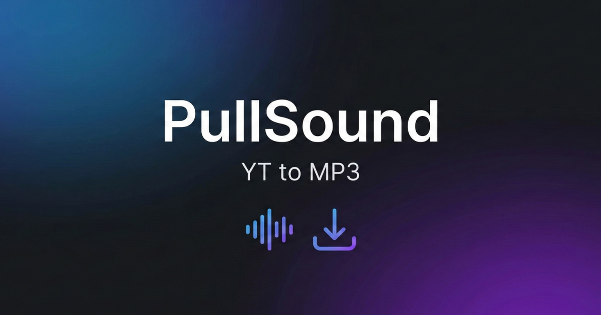

# 🎵 PullSound



[](https://www.python.org/)
[](https://flask.palletsprojects.com/)
[](https://socket.io/)
[](https://github.com/yt-dlp/yt-dlp)

**PullSound** es una aplicación web moderna, rápida y elegante diseñada para extraer y convertir audio desde YouTube y Spotify en máxima calidad. Construida con una arquitectura orientada a eventos (WebSocket) y una interfaz de usuario premium basada en *Glassmorphism*.

---

## ✨ Características Principales

- 🎨 **Interfaz de Usuario Premium:** Diseño moderno con *Glassmorphism*, animaciones fluidas, modo claro/oscuro y diseño responsivo.
- ⚡ **Progreso en Tiempo Real:** Olvídate de recargar la página. Gracias a Socket.IO, ves el progreso de descarga de cada archivo byte a byte en tiempo real.
- 🚀 **Descarga Masiva Inteligente:** Capacidad de descargar playlists completas (hasta 100 canciones por lote) con un gestor de concurrencia avanzado (3 descargas simultáneas) para no saturar la red ni la memoria. Al finalizar, te entrega todo en un cómodo archivo `.zip`.
- 🎧 **Soporte Spotify Nativo:** Integración con `spotdl` para descargar canciones o playlists de Spotify de forma directa, obteniendo la mejor metadata y carátulas (covers) directamente desde la API.
- 🎶 **Previsualización de Audio:** Generación de fragmentos de 15 segundos para previsualizar el audio antes de descargarlo.
- 📱 **Soporte PWA (Progressive Web App):** Instala PullSound en tu PC, Android o iOS y úsala como una aplicación nativa, con soporte offline y tiempos de carga ultrarrápidos gracias a Service Workers.

---

## 🛠️ Tecnologías Utilizadas

### Backend (Servidor)
- **Python 3.10+**
- **Flask** & **Flask-SocketIO** (API REST & WebSockets)
- **yt-dlp** & **spotdl** (Motores de extracción de media)
- **FFmpeg** (Procesamiento y conversión de audio)
- **Gunicorn** (Servidor WSGI para producción)

### Frontend (Cliente)
- **HTML5 & Vanilla JavaScript** (Sin frameworks pesados, máxima velocidad)
- **CSS3 Moderno** (Variables nativas, animaciones y Glassmorphism)
- **Socket.IO Client**

---

## 🚀 Instalación y Despliegue Local

### Prerrequisitos
- Python 3.10 o superior.
- **FFmpeg** instalado y configurado en el PATH de tu sistema operativo.

### Pasos a seguir

1. **Clona el repositorio:**
   ```bash
   git clone https://github.com/tu-usuario/PullSound.git
   cd PullSound
   ```

2. **Crea y activa un entorno virtual:**
   ```bash
   python -m venv venv
   # En Windows:
   venv\Scripts\activate
   # En Linux/Mac:
   source venv/bin/activate
   ```

3. **Instala las dependencias:**
   ```bash
   pip install -r backend/requirements.txt
   ```

4. **Configura las variables de entorno:**
   Copia el archivo `.env.example` y renómbralo a `.env`.
   ```bash
   cp .env.example .env
   ```
   *Opcional: Ajusta los límites de rate-limit y la concurrencia según la capacidad de tu hardware en el archivo `.env`.*

5. **Inicia el servidor:**
   ```bash
   python main.py
   ```

6. **¡Listo!** Abre tu navegador y visita: `http://localhost:5000`

---

## ☁️ Despliegue en Producción (Render, Heroku, VPS)

El proyecto está configurado para ser desplegado fácilmente en plataformas PaaS. Incluye archivos `gunicorn_config.py` y soporte para variables de entorno para producción.

**Importante para producción:**
- Es **crítico** instalar `ffmpeg` en el servidor host. Si usas plataformas como Render, deberás asegurar que el entorno cuente con el paquete `ffmpeg` (por ejemplo, mediante Docker o scripts de inicialización `apt.txt`).
- Para descargas estables a largo plazo desde YouTube, se recomienda extraer tu archivo `cookies.txt` (usando extensiones como *Get cookies.txt LOCALLY*) y colocarlo en el entorno (añadido al `.gitignore` para tu seguridad).

---

## ⚠️ Aviso Legal (Disclaimer)

> Esta aplicación ha sido desarrollada **únicamente con fines educativos y de investigación**. 
> 
> El desarrollador no asume ninguna responsabilidad por el uso indebido de esta herramienta. Descargar material protegido por derechos de autor sin el permiso explícito de los propietarios es ilegal en muchos países. Por favor, respeta los Términos de Servicio de YouTube, Spotify y los derechos de los creadores de contenido.

---

## 🤝 Contribuciones

¡Las contribuciones son bienvenidas! Si deseas mejorar PullSound, siéntete libre de hacer un *Fork* del repositorio, crear una rama con tus mejoras (`git checkout -b feature/MejoraIncreible`) y enviar un *Pull Request*.

1. Haz un Fork del proyecto.
2. Crea tu Feature Branch (`git checkout -b feature/AmazingFeature`).
3. Haz Commit de tus cambios (`git commit -m 'Add some AmazingFeature'`).
4. Haz Push a la rama (`git push origin feature/AmazingFeature`).
5. Abre un Pull Request.

---

### 🦕 *"Porque hasta un Yoshi necesita una buena banda sonora"*
